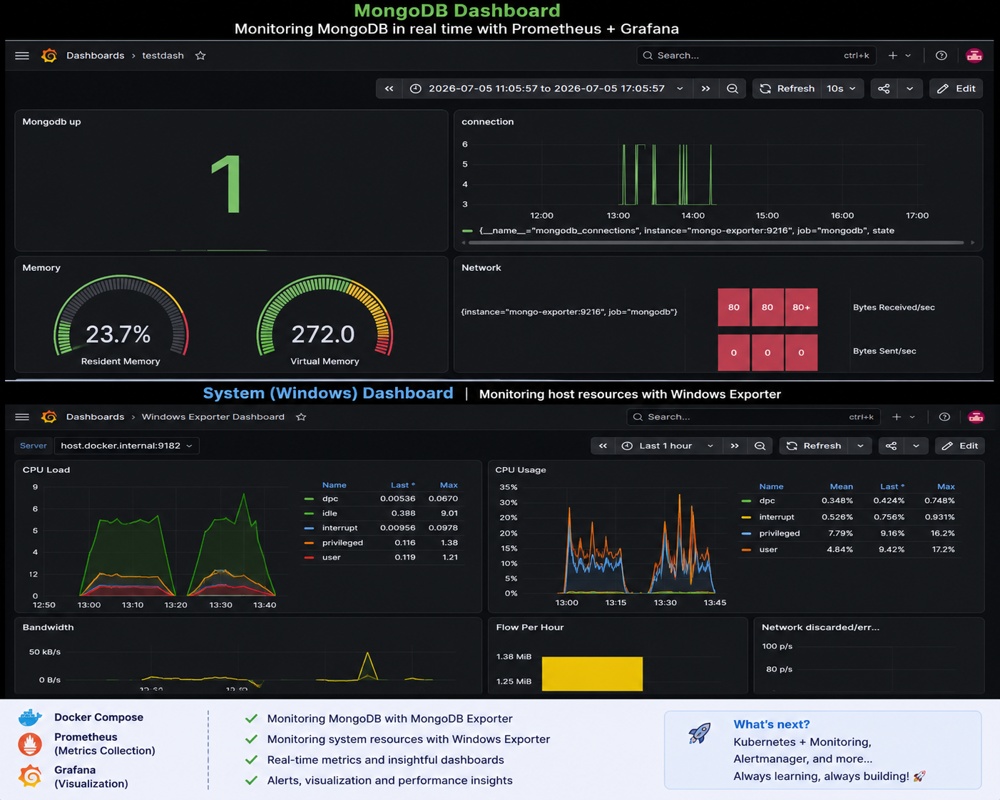

# Monitoring Stack with Prometheus, Grafana & MongoDB

A hands-on monitoring project built to learn how modern observability stacks work.

The project demonstrates how to collect metrics from both a MongoDB database and a Windows machine using Prometheus exporters, and visualize them with Grafana dashboards.

---

## Dashboard Preview



---

## Technologies

- Docker & Docker Compose
- Prometheus
- Grafana
- MongoDB
- MongoDB Exporter
- Windows Exporter
- Linux

---

## Architecture

```
                +----------------------+
                |    Windows Machine   |
                |  Windows Exporter    |
                +----------+-----------+
                           |
                           |
                           v
+-------------+      +--------------+
|  MongoDB    | ---> | Mongo Export |
+-------------+      +--------------+
         \                 /
          \               /
           \             /
            v           v
          +------------------+
          |   Prometheus     |
          | Metrics Collector|
          +--------+---------+
                   |
                   |
                   v
             +------------+
             |  Grafana   |
             | Dashboards |
             +------------+
```

---

## Dashboards

### MongoDB Dashboard

Displays metrics such as:

- MongoDB Status
- Active Connections
- Resident Memory
- Virtual Memory
- Network Traffic

---

### Windows Dashboard

Monitors the host machine using Windows Exporter.

Metrics include:

- CPU Usage
- CPU Load
- Memory
- Disk Usage
- Network Traffic
- Bandwidth

---

## Project Structure

```
monitoring-stack/
│
├── docker-compose.yml
├── prometheus/
│   └── prometheus.yml
├── grafana/
│   ├── provisioning/
│   └── dashboards/
├── mongodb/
├── images/
│   └── dashboard.png
└── README.md
```

---

## How To Run

Clone the repository

```bash
git clone https://github.com/yourusername/monitoring-stack.git
```

Go into the project

```bash
cd monitoring-stack
```

Start the containers

```bash
docker compose up -d
```

Open Grafana

```
http://localhost:3000
```

Default credentials

```
Username: admin
Password: admin
```

---

## What I Learned

During this project I learned how to:

- Deploy a monitoring stack using Docker Compose
- Configure Prometheus scrape targets
- Collect metrics using Exporters
- Monitor MongoDB
- Monitor Windows host resources
- Build Grafana dashboards
- Create PromQL queries
- Visualize system metrics in real time

---

## Future Improvements

- [ ] Alertmanager integration
- [ ] Email alerts
- [ ] Kubernetes monitoring
- [ ] Node Exporter on Linux
- [ ] Dashboard provisioning
- [ ] Persistent Grafana storage

